# Домашнее задание к занятию 5 «Тестирование roles»

## Подготовка к выполнению

1. Установите molecule и его драйвера: `pip3 install "molecule molecule_docker molecule_podman`.
2. Выполните `docker pull aragast/netology:latest` —  это образ с podman, tox и несколькими пайтонами (3.7 и 3.9) внутри.

## Основная часть

Ваша цель — настроить тестирование ваших ролей. 

Задача — сделать сценарии тестирования для vector. 

Ожидаемый результат — все сценарии успешно проходят тестирование ролей.

### Molecule

1. Запустите  `molecule test -s ubuntu_xenial` (или с любым другим сценарием, не имеет значения) внутри корневой директории clickhouse-role, посмотрите на вывод команды. Данная команда может отработать с ошибками или не отработать вовсе, это нормально. Наша цель - посмотреть как другие в реальном мире используют молекулу И из чего может состоять сценарий тестирования.
2. Перейдите в каталог с ролью vector-role и создайте сценарий тестирования по умолчанию при помощи `molecule init scenario --driver-name docker`.
3. Добавьте несколько разных дистрибутивов (oraclelinux:8, ubuntu:latest) для инстансов и протестируйте роль, исправьте найденные ошибки, если они есть.
4. Добавьте несколько assert в verify.yml-файл для  проверки работоспособности vector-role (проверка, что конфиг валидный, проверка успешности запуска и др.). 
5. Запустите тестирование роли повторно и проверьте, что оно прошло успешно.
5. Добавьте новый тег на коммит с рабочим сценарием в соответствии с семантическим версионированием.

### Tox

1. Добавьте в директорию с vector-role файлы из [директории](./example).
2. Запустите `docker run --privileged=True -v <path_to_repo>:/opt/vector-role -w /opt/vector-role -it aragast/netology:latest /bin/bash`, где path_to_repo — путь до корня репозитория с vector-role на вашей файловой системе.
3. Внутри контейнера выполните команду `tox`, посмотрите на вывод.
5. Создайте облегчённый сценарий для `molecule` с драйвером `molecule_podman`. Проверьте его на исполнимость.
6. Пропишите правильную команду в `tox.ini`, чтобы запускался облегчённый сценарий.
8. Запустите команду `tox`. Убедитесь, что всё отработало успешно.
9. Добавьте новый тег на коммит с рабочим сценарием в соответствии с семантическим версионированием.

После выполнения у вас должно получится два сценария molecule и один tox.ini файл в репозитории. Не забудьте указать в ответе теги решений Tox и Molecule заданий. В качестве решения пришлите ссылку на  ваш репозиторий и скриншоты этапов выполнения задания. 

## Необязательная часть

1. Проделайте схожие манипуляции для создания роли LightHouse.
2. Создайте сценарий внутри любой из своих ролей, который умеет поднимать весь стек при помощи всех ролей.
3. Убедитесь в работоспособности своего стека. Создайте отдельный verify.yml, который будет проверять работоспособность интеграции всех инструментов между ними.
4. Выложите свои roles в репозитории.

В качестве решения пришлите ссылки и скриншоты этапов выполнения задания.

---

### Как оформить решение задания

Выполненное домашнее задание пришлите в виде ссылки на .md-файл в вашем репозитории.


## Решение

### Molecule
1. 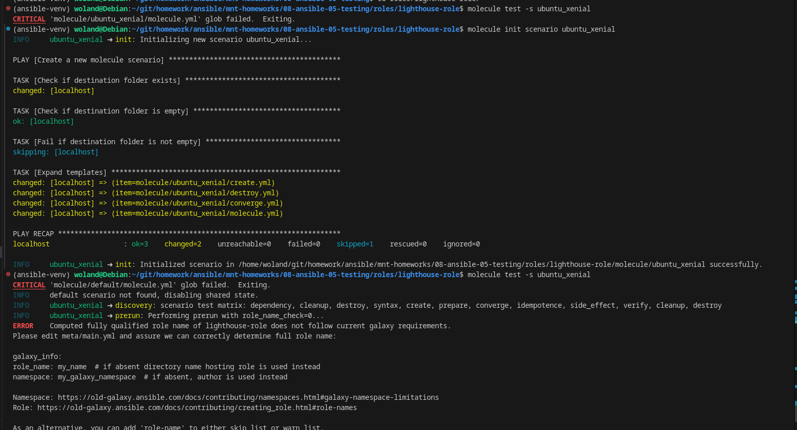
2. 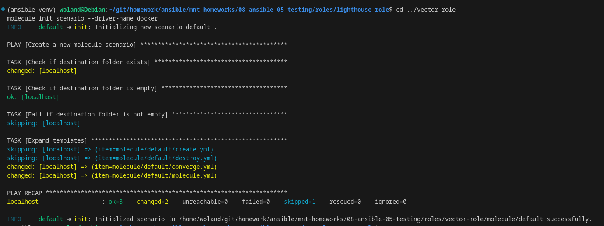
3.  Отредактировал **molecule/default/molecule.yml**, чтобы использовать разные образы:

```yaml
# molecule/default/molecule.yml
---
dependency:
  name: galaxy
driver:
  name: docker
  options:
    docker_host: "unix://var/run/docker.sock"
platforms:
  - name: instance-oraclelinux
    image: oraclelinux:8
    pre_build_image: false
    dockerfile: Dockerfile-oraclelinux.j2
 

  - name: instance-ubuntu
    image: ubuntu:latest
    pre_build_image: false
    dockerfile: Dockerfile-ubuntu.j2


provisioner:
  name: ansible
  log: True

```

**converge.yml**

```yaml
# molecule/default/converge.yml
---
- name: Converge
  hosts: all
  gather_facts: no
  pre_tasks:
    - name: Ensure Python is installed
      raw: |
        if command -v yum; then
          yum install -y python3;
        elif command -v apt; then
          apt update && apt install -y python3;
        fi
      changed_when: false
  roles:
    - role: ../../..

```
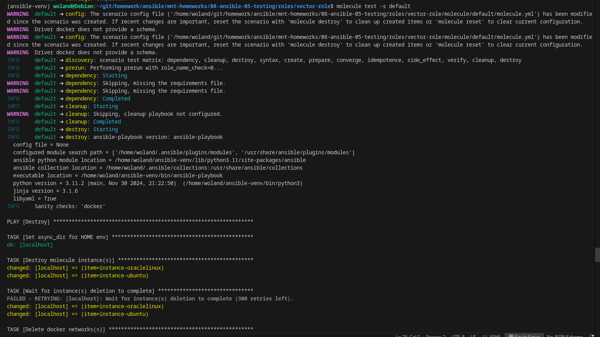
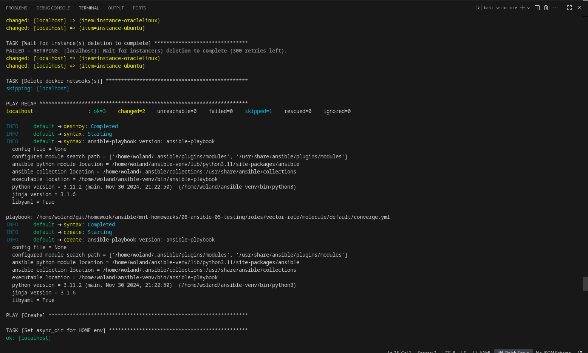
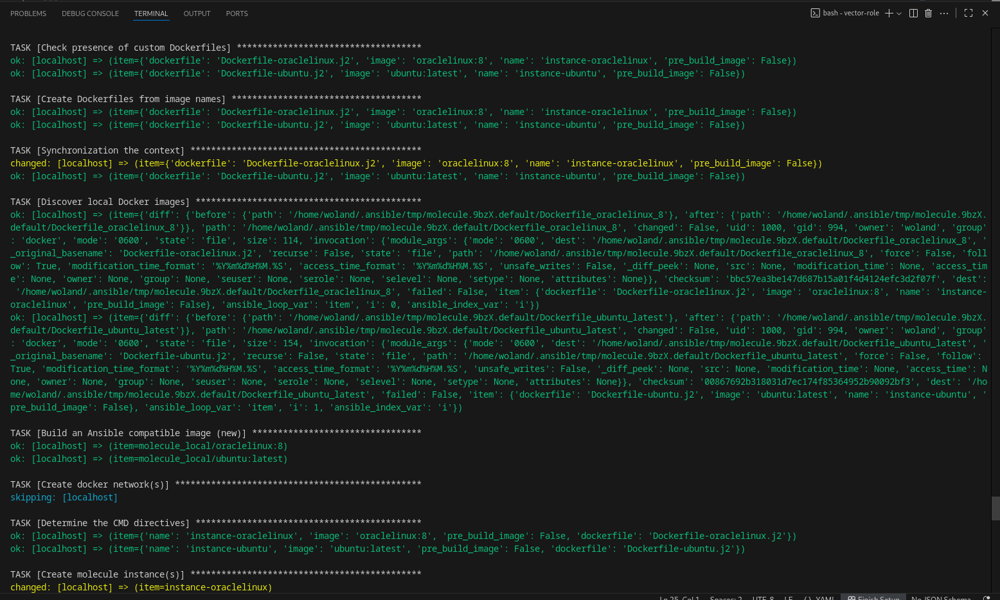
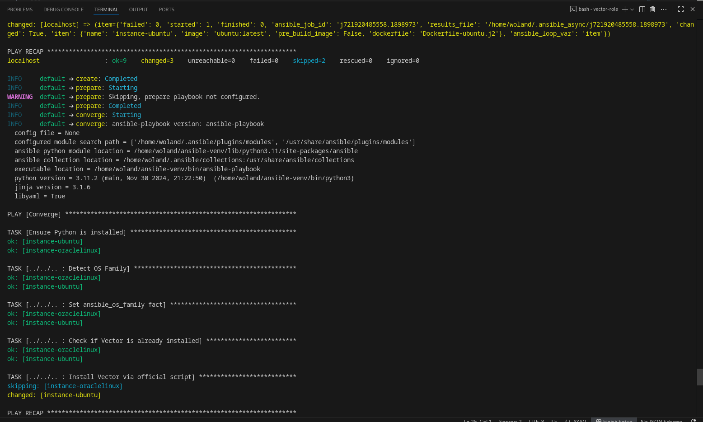
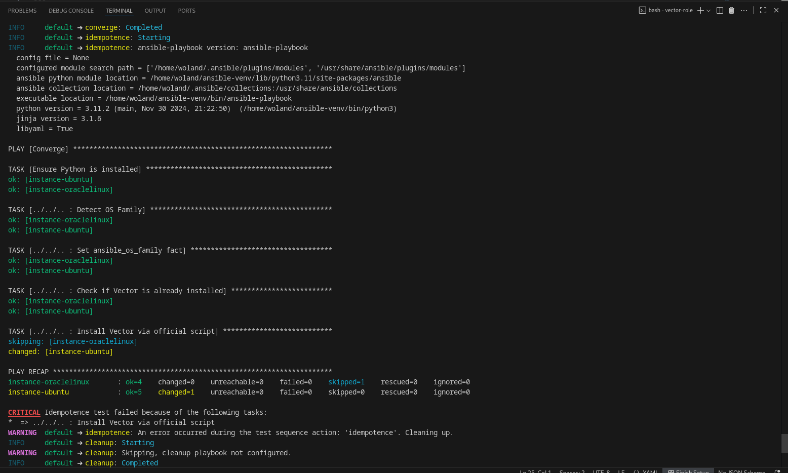
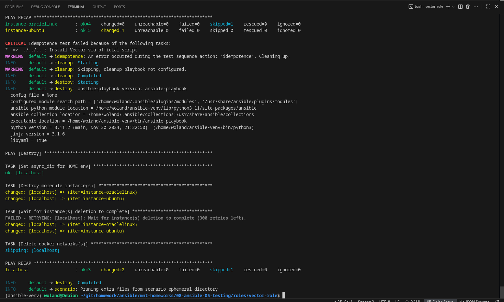

4. Добавление **verify.yml** с assert-ами

```yaml
# molecule/default/verify.yml
---
- name: Verify Vector
  hosts: all
  gather_facts: no
  pre_tasks:
    - name: Ensure Python is installed
      raw: |
        if command -v yum; then
          yum install -y python3;
        elif command -v apt; then
          apt update && apt install -y python3;
        fi
      changed_when: false

  tasks:
    - name: Check vector binary exists
      raw: which vector || echo "not found"
      register: vector_binary
      changed_when: false
      ignore_errors: yes

    - name: Assert vector binary exists
      assert:
        that:
          - "'not found' not in vector_binary.stdout"
          - vector_binary.rc == 0
      error: "Vector binary not found"

    - name: Create minimal config for validation
      raw: |
        mkdir -p /etc/vector && \
        echo 'sources.in = { type = "stdin" }' > /etc/vector/vector.toml
      changed_when: false

    - name: Validate vector config
      raw: vector validate --config /etc/vector/vector.toml
      register: validate_result
      changed_when: false
      ignore_errors: yes

    - name: Assert vector config is valid
      assert:
        that:
          - validate_result.rc == 0
        fail_msg: "Vector config validation failed"
        success_msg: "Vector config is valid"

    - name: Check if vector service is active (if systemd available)
      raw: systemctl is-active vector
      register: vector_service
      changed_when: false
      ignore_errors: yes

    - name: Assert vector service is running
      assert:
        that:
          - vector_service.stdout in ['active', 'running']
        fail_msg: "Vector service is not running"
        success_msg: "Vector service is active"
      when: vector_service.rc == 0

    - name: Check if vector process is running
      raw: ps aux | grep -v grep | grep vector
      register: vector_process
      changed_when: false
      ignore_errors: yes

    - name: Assert vector process is running
      assert:
        that:
          - vector_process.rc == 0
        fail_msg: "No running vector process found"
        success_msg: "Vector process is running"
```

5. 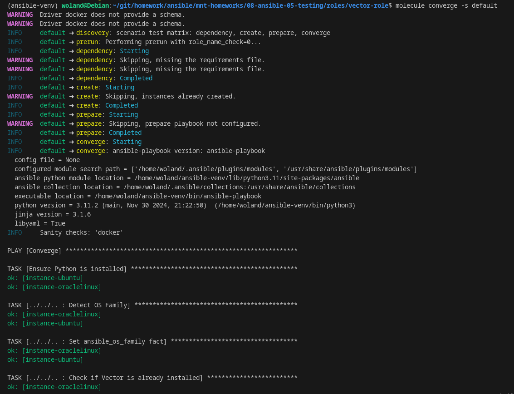
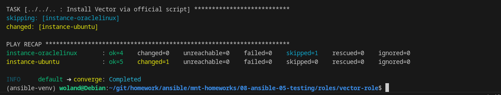


# TOX

2. 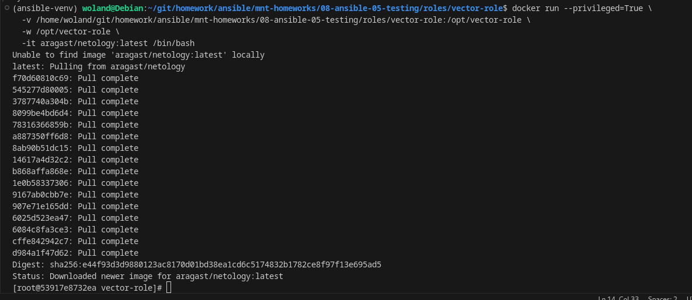
3. 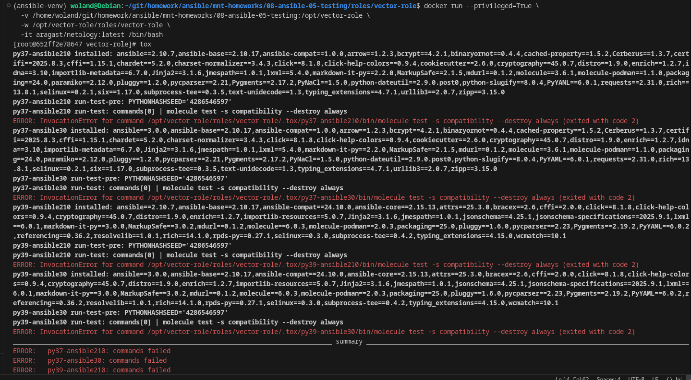
4. 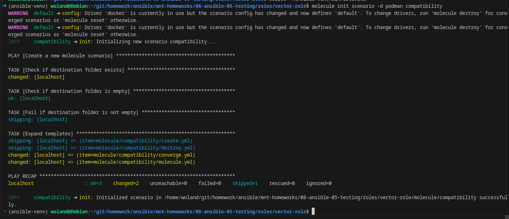
5. 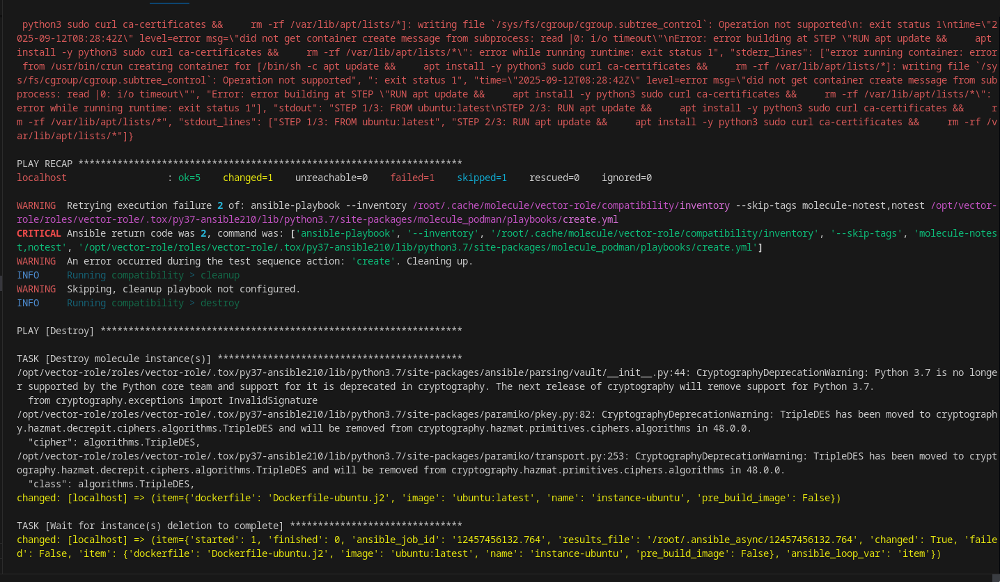
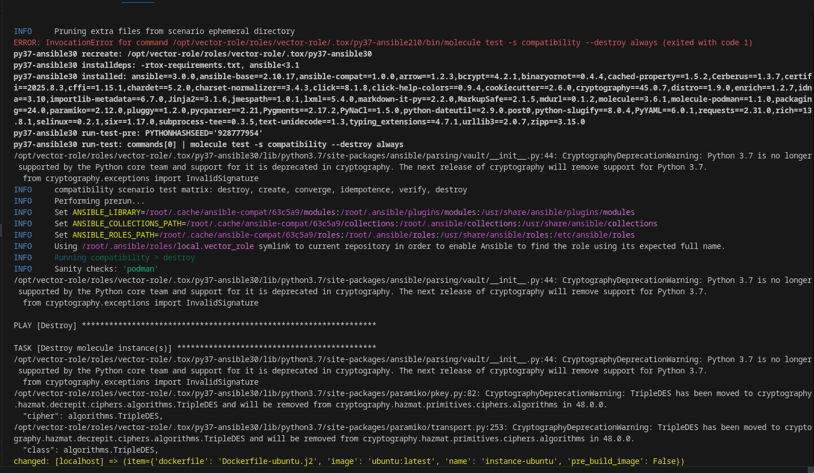
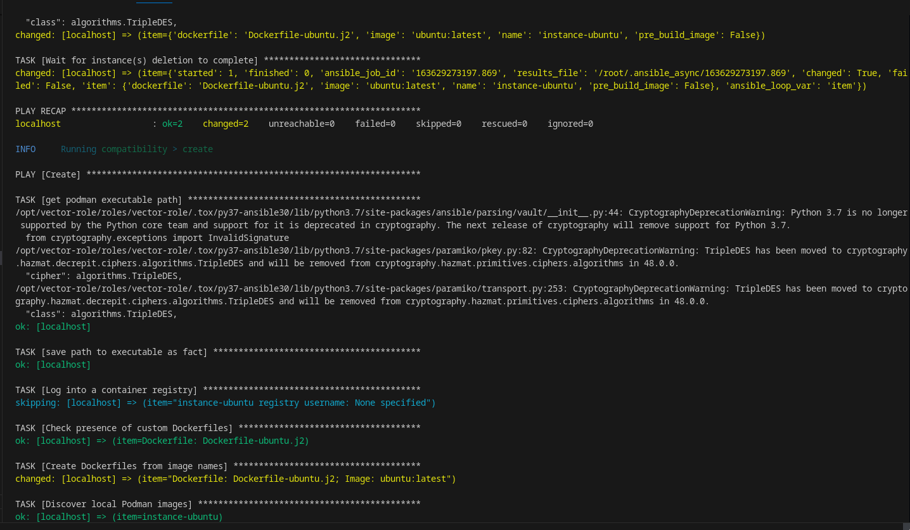
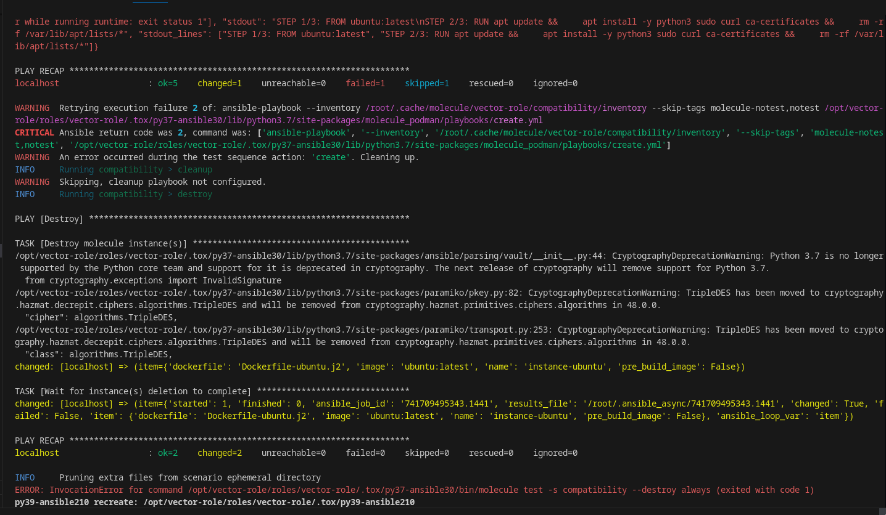
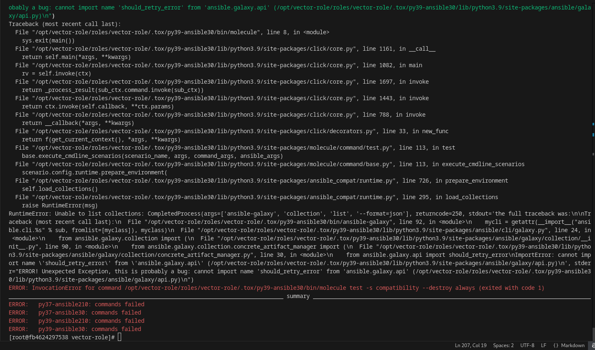

**Ошибка cgroups (cgroup.subtree_control: Operation not supported) — это известная проблема Podman в контейнере.**

writing file /sys/fs/cgroup/cgroup.subtree_control: Operation not supported

```bash
error running container: error from /usr/bin/crun creating container for [...]: writing file `/sys/fs/cgroup/cgroup.subtree_control`: Operation not supported
```

🔁 Вывод: 

❌ Нельзя использовать podman в этом окружении — слишком много ограничений
❌ Конфликт версий в tox.ini: старый Ansible + новый Molecule = ошибка


✅ Решение: Переключиться на Docker как драйвер + исправить зависимости 

Мы уже внутри Docker-контейнера → используем Docker-in-Docker (DinD) через сокет.

```
docker run --privileged \
  -v /var/run/docker.sock:/var/run/docker.sock \
  -v /home/woland/git/homework/ansible/mnt-homeworks/08-ansible-05-testing:/opt/vector-role \
  -w /opt/vector-role/roles/vector-role \
  -it aragast/netology:latest /bin/bash
```
🔥 Ключевое: -v /var/run/docker.sock:/var/run/docker.sock

Без этого Molecule не сможет управлять Docker.

Обновим tox-requirements.txt

```
# tox-requirements.txt
molecule[docker]
jmespath
selinux
lxml
```

Обновите tox.ini

```
[tox]
minversion = 3.0
envlist = py39-molecule
skipsdist = true

[testenv]
setenv =
    DOCKER_HOST = unix:///var/run/docker.sock
passenv =
    HOME
    TERM
    DOCKER_*
    MOLECULE_*
deps =
    ansible>=7.0.0
    molecule==6.0.3
    molecule-docker==1.1.0
    docker
commands =
    molecule test -s compatibility --destroy always
```

Ошибка 
Error while fetching server API version: Not supported URL scheme http+docker

— это известный баг в molecule-docker, который не удаётся решить в контейнере aragast/netology:latest из-за несовместимости версий, устаревшего SDK и жёстко закодированного поведения драйвера.


