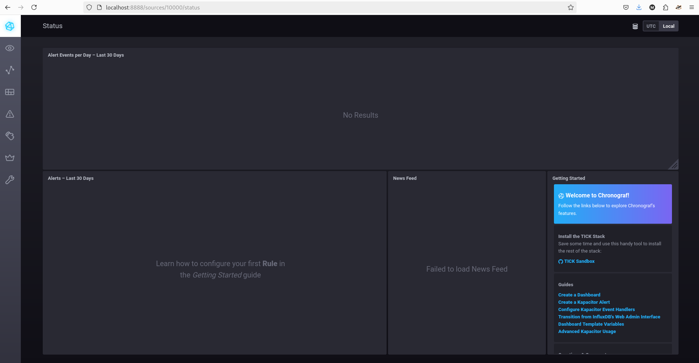
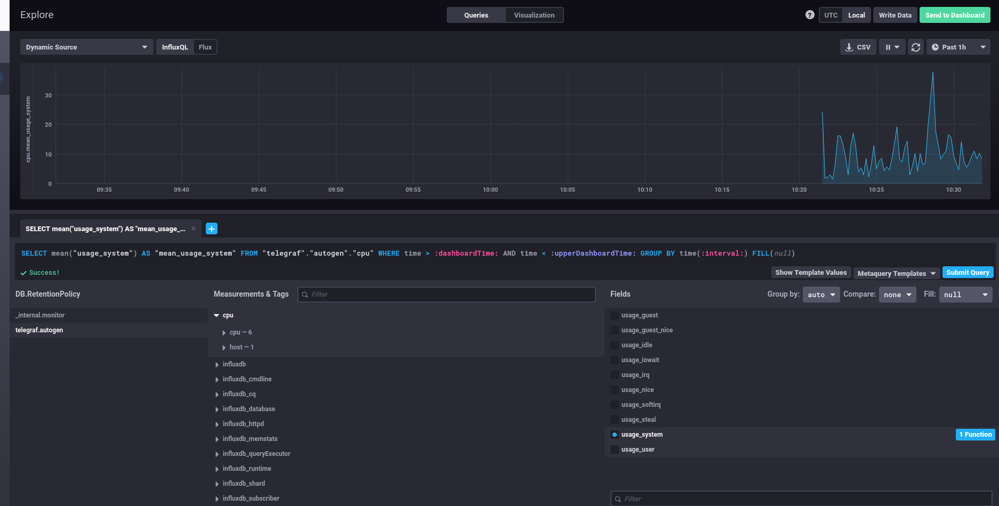
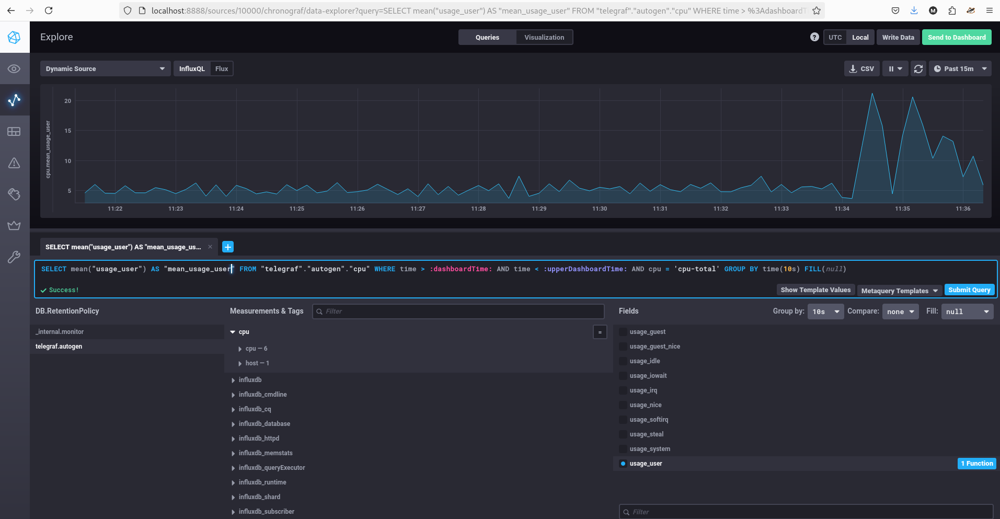
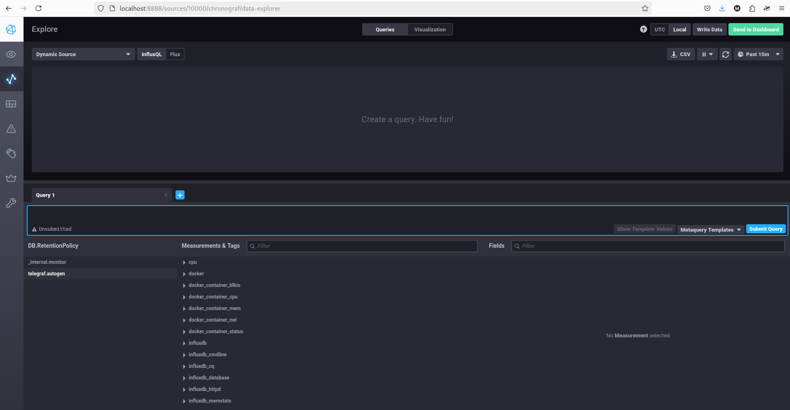

# Домашнее задание к занятию "13.Системы мониторинга" - Барышков Михаил

## Обязательные задания

1. Вас пригласили настроить мониторинг на проект. На онбординге вам рассказали, что проект представляет из себя 
платформу для вычислений с выдачей текстовых отчетов, которые сохраняются на диск. Взаимодействие с платформой 
осуществляется по протоколу http. Также вам отметили, что вычисления загружают ЦПУ. Какой минимальный набор метрик вы
выведите в мониторинг и почему?
#
2. Менеджер продукта посмотрев на ваши метрики сказал, что ему непонятно что такое RAM/inodes/CPUla. Также он сказал, 
что хочет понимать, насколько мы выполняем свои обязанности перед клиентами и какое качество обслуживания. Что вы 
можете ему предложить?
#
3. Вашей DevOps команде в этом году не выделили финансирование на построение системы сбора логов. Разработчики в свою 
очередь хотят видеть все ошибки, которые выдают их приложения. Какое решение вы можете предпринять в этой ситуации, 
чтобы разработчики получали ошибки приложения?
#
4. Вы, как опытный SRE, сделали мониторинг, куда вывели отображения выполнения SLA=99% по http кодам ответов. 
Вычисляете этот параметр по следующей формуле: summ_2xx_requests/summ_all_requests. Данный параметр не поднимается выше 
70%, но при этом в вашей системе нет кодов ответа 5xx и 4xx. Где у вас ошибка?
#
5. Опишите основные плюсы и минусы pull и push систем мониторинга.
#
6. Какие из ниже перечисленных систем относятся к push модели, а какие к pull? А может есть гибридные?

    - Prometheus 
    - TICK
    - Zabbix
    - VictoriaMetrics
    - Nagios
#
7. Склонируйте себе [репозиторий](https://github.com/influxdata/sandbox/tree/master) и запустите TICK-стэк, 
используя технологии docker и docker-compose.

В виде решения на это упражнение приведите скриншот веб-интерфейса ПО chronograf (`http://localhost:8888`). 

P.S.: если при запуске некоторые контейнеры будут падать с ошибкой - проставьте им режим `Z`, например
`./data:/var/lib:Z`
#
8. Перейдите в веб-интерфейс Chronograf (http://localhost:8888) и откройте вкладку Data explorer.
        
    - Нажмите на кнопку Add a query
    - Изучите вывод интерфейса и выберите БД telegraf.autogen
    - В `measurments` выберите cpu->host->telegraf-getting-started, а в `fields` выберите usage_system. Внизу появится график утилизации cpu.
    - Вверху вы можете увидеть запрос, аналогичный SQL-синтаксису. Поэкспериментируйте с запросом, попробуйте изменить группировку и интервал наблюдений.

Для выполнения задания приведите скриншот с отображением метрик утилизации cpu из веб-интерфейса.
#
9. Изучите список [telegraf inputs](https://github.com/influxdata/telegraf/tree/master/plugins/inputs). 
Добавьте в конфигурацию telegraf следующий плагин - [docker](https://github.com/influxdata/telegraf/tree/master/plugins/inputs/docker):
```
[[inputs.docker]]
  endpoint = "unix:///var/run/docker.sock"
```

Дополнительно вам может потребоваться донастройка контейнера telegraf в `docker-compose.yml` дополнительного volume и 
режима privileged:
```
  telegraf:
    image: telegraf:1.4.0
    privileged: true
    volumes:
      - ./etc/telegraf.conf:/etc/telegraf/telegraf.conf:Z
      - /var/run/docker.sock:/var/run/docker.sock:Z
    links:
      - influxdb
    ports:
      - "8092:8092/udp"
      - "8094:8094"
      - "8125:8125/udp"
```

После настройке перезапустите telegraf, обновите веб интерфейс и приведите скриншотом список `measurments` в 
веб-интерфейсе базы telegraf.autogen . Там должны появиться метрики, связанные с docker.

Факультативно можете изучить какие метрики собирает telegraf после выполнения данного задания.

## Дополнительное задание (со звездочкой*) - необязательно к выполнению

1. Вы устроились на работу в стартап. На данный момент у вас нет возможности развернуть полноценную систему 
мониторинга, и вы решили самостоятельно написать простой python3-скрипт для сбора основных метрик сервера. Вы, как 
опытный системный-администратор, знаете, что системная информация сервера лежит в директории `/proc`. 
Также, вы знаете, что в системе Linux есть  планировщик задач cron, который может запускать задачи по расписанию.

Суммировав все, вы спроектировали приложение, которое:
- является python3 скриптом
- собирает метрики из папки `/proc`
- складывает метрики в файл 'YY-MM-DD-awesome-monitoring.log' в директорию /var/log 
(YY - год, MM - месяц, DD - день)
- каждый сбор метрик складывается в виде json-строки, в виде:
  + timestamp (временная метка, int, unixtimestamp)
  + metric_1 (метрика 1)
  + metric_2 (метрика 2)
  
     ...
     
  + metric_N (метрика N)
  
- сбор метрик происходит каждую 1 минуту по cron-расписанию

Для успешного выполнения задания нужно привести:

а) работающий код python3-скрипта,

б) конфигурацию cron-расписания,

в) пример верно сформированного 'YY-MM-DD-awesome-monitoring.log', имеющий не менее 5 записей,

P.S.: количество собираемых метрик должно быть не менее 4-х.
P.P.S.: по желанию можно себя не ограничивать только сбором метрик из `/proc`.

2. В веб-интерфейсе откройте вкладку `Dashboards`. Попробуйте создать свой dashboard с отображением:

    - утилизации ЦПУ
    - количества использованного RAM
    - утилизации пространства на дисках
    - количество поднятых контейнеров
    - аптайм
    - ...
    - фантазируйте)
    
    ---

### Как оформить ДЗ?

Выполненное домашнее задание пришлите ссылкой на .md-файл в вашем репозитории.

---


## Решение

### 1. Минимальный набор метрик для мониторинга платформы

**Контекст**: платформа выполняет вычисления (нагружают CPU), сохраняет отчёты на диск, взаимодействие — по HTTP.

**Минимальный набор метрик**:

| Категория        | Метрики                                                                 | Обоснование                                                                 |
|------------------|-------------------------------------------------------------------------|-----------------------------------------------------------------------------|
| **HTTP-сервис**  | - Количество запросов в секунду (RPS)<br>- Коды ответов HTTP (2xx, 4xx, 5xx)<br>- Время ответа (latency, p95, p99) | Позволяет отслеживать доступность, корректность работы и производительность API. |
| **CPU**          | - Загрузка CPU (%)<br>- Время в пользовательском/системном режиме        | Вычисления нагружают CPU — важно отслеживать узкие места и перегрузки.      |
| **Диск**         | - Использование дискового пространства (%)<br>- Количество inodes<br>- IOPS / throughput записи | Отчёты сохраняются на диск — возможны проблемы с переполнением или исчерпанием inodes. |
| **Память**       | - Использование RAM (%)<br>- Swap usage                                 | Чтобы избежать OOM и деградации производительности.                         |
| **Системные**    | - Количество запущенных процессов приложения<br>- Uptime сервиса        | Базовая информация о работоспособности.                                     |

> **Почему именно эти метрики?**  
> Они охватывают ключевые аспекты: **доступность**, **производительность**, **ресурсное состояние** и **надёжность хранения данных** — всё, что критично для описанной системы.

---

### 2. Как сделать метрики понятными для менеджера продукта и отразить качество обслуживания

Менеджеру не нужны технические детали (RAM, inodes, CPUla). Ему важны **бизнес-метрики** и **показатели качества сервиса**.

**Что предложить**:

- **SLI (Service Level Indicators)**:
  - **Доступность**: доля успешных запросов (например, HTTP 2xx) за период → **SLA = 99.9%**.
  - **Латентность**: время генерации отчёта (например, 95% отчётов генерируются < 5 сек).
  - **Точность**: доля корректно сгенерированных отчётов (можно через логи ошибок или валидацию).

- **SLO/SLA дашборды**:
  - Визуализация: «Сегодня сервис выполнил 99.2% обещаний клиентам».
  - График: «Среднее время выдачи отчёта — 2.1 сек».

- **Бизнес-ориентированные KPI**:
  - Количество успешно завершённых задач в день.
  - Доля пользователей, получивших отчёт без ошибок.
  - Время до первой ошибки (MTBF) / время восстановления (MTTR).

> **Итог**: заменить технические метрики на **понятные бизнес-показатели**, связанные с **обязательствами перед клиентами** и **качеством сервиса**.

---

### 3. Решение для сбора ошибок приложений без бюджета на систему логов

**Проблема**: нет денег на ELK, Loki, Grafana Logs и т.п., но разработчикам нужны ошибки.

**Решения**:

1. **Использовать stdout/stderr + journalctl (systemd)**:
   - Приложения пишут логи в stdout/stderr.
   - systemd собирает их в journald.
   - Разработчики могут смотреть ошибки через:  
     ```bash
     journalctl -u myapp.service -p err --since today
     ```

2. **Ротация логов в файлы + grep**:
   - Настроить запись ошибок в отдельный файл (например, `/var/log/app/errors.log`).
   - Использовать `logrotate` для ротации.
   - Разработчики получают доступ к файлу по SSH или через простой веб-интерфейс.

3. **Telegram/email алерты на ошибки**:
   - Написать простой скрипт, который парсит логи и отправляет уведомления при появлении `ERROR` или `Exception`.
   - Использовать `cron` + `grep` + `curl` к Telegram Bot API.

4. **Интеграция с Sentry (бесплатный tier)**:
   - Sentry имеет бесплатный план (до 5k событий/месяц).
   - Лёгкая интеграция с большинством языков.
   - Централизованный просмотр ошибок, стек-трейсы, агрегация.

> **Вывод**: даже без бюджета можно организовать **минимально жизнеспособную систему сбора ошибок** через стандартные средства ОС или бесплатные SaaS-решения.

---

### 4. Ошибка в расчёте SLA = 99% по формуле `summ_2xx_requests / summ_all_requests`

**Ситуация**: SLA не поднимается выше 70%, но 4xx/5xx нет.

**Где ошибка?**

Вероятнее всего, **в знаменателе учитываются не только HTTP-запросы**, а **все входящие соединения**, включая:

- TCP-соединения без HTTP-запроса (например, health-check от балансировщика),
- Незавершённые соединения,
- Запросы с таймаутом (не дошли до приложения),
- Запросы с некорректным HTTP.

**Но главное** — **в числителе только 2xx**, а в знаменателе — **все запросы, включая 3xx**!

> Например, редиректы (301, 302) — это **успешные** ответы, но они **не 2xx**, поэтому снижают SLA.

**Решение**:
- Использовать формулу: 

(2xx + 3xx) / (все HTTP-ответы)

или, если 3xx считаются ошибками — явно это указать.
- Убедиться, что в знаменателе **только завершённые HTTP-запросы**, а не сырые соединения.
- Исключить из расчёта health-check запросы (если они не от клиента).

> **Вывод**: ошибка в определении "успешного запроса" и/или в составе знаменателя.

---

### 5. Плюсы и минусы pull- и push-моделей мониторинга

| Модель | Плюсы | Минусы |
|--------|-------|--------|
| **Pull** (сервер опрашивает клиентов) | - Простота настройки клиентов (экспортеры)<br>- Централизованное управление сбором<br>- Легко отключить проблемный хост<br>- Безопасность: клиенты не инициируют исходящие подключения | - Требует сетевой доступности клиентов<br>- Сложно масштабировать при большом числе целей<br>- Проблемы с NAT/firewall<br>- Возможны пропуски данных при недоступности |
| **Push** (клиенты отправляют данные на сервер) | - Работает за NAT/firewall<br>- Лучше для динамических сред (контейнеры, serverless)<br>- Гибкость в частоте отправки<br>- Меньше нагрузки на сервер (нет постоянных опросов) | - Сложнее управлять клиентами<br>- Риск потери данных при падении агента<br>- Нужно аутентифицировать/авторизовать клиентов<br>- Возможна перегрузка сервера при массовом push |

---

### 6. Классификация систем мониторинга по модели

| Система           | Модель       | Комментарий |
|--------------------|--------------|-------------|
| **Prometheus**     | Pull         | Опрашивает `/metrics` эндпоинты. Поддерживает pushgateway для временных задач (гибридный элемент, но основная модель — pull). |
| **TICK**           | Push         | Telegraf собирает метрики и **отправляет** в InfluxDB. |
| **Zabbix**         | Гибридная    | Поддерживает **оба режима**: активные проверки (pull) и пассивные (push). |
| **VictoriaMetrics**| Гибридная    | Может работать как в режиме **pull** (через vmagent), так и в **push** (принимает данные по HTTP API). |
| **Nagios**         | Pull         | Сервер опрашивает хосты через плагины (check_http, check_cpu и т.д.). |

> **Примечание**: многие современные системы стремятся к гибридности для гибкости развёртывания.

### 7


### 8




### 9
 